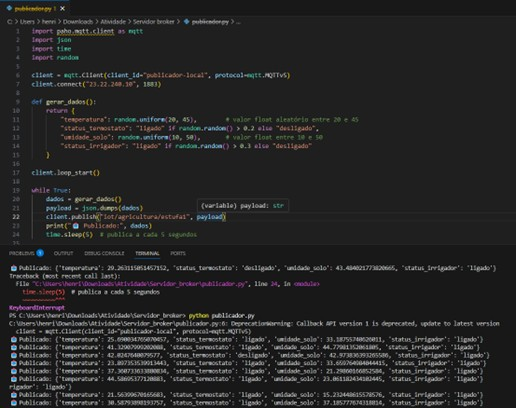
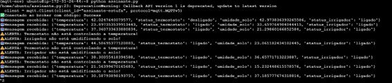

# **1. Descrição da Solução**
### **Área de aplicação escoliha** 
A área escolhida é a **Agricultura (Cúpulas Agrícolas)**
A solução propõe o uso de IoT para o monitoramento e controle automatizado de temperatura, iluminação e umidade do solo em estufas agrícolas. Isso garante um ambiente controlado ideal para o cultivo, mesmo em condições externas adversas.

# **justificativa da escolha**
Com o crescimento da demanda por eficiência na produção agrícola, o uso de cúpulas com sensores conectados permite um controle preciso das variáveis ambientais. Automatizar esse processo reduz custos, aumenta a produtividade e previne perdas por falhas humanas ou climáticas.

### **Explicação de como o publicador, assinante e broker interagem na solução**

- **Publicador:** : Sensores de temperatura, umidade do solo e luminosidade enviam dados periódicos via MQTT em JSON para um broker. Esses dados são enviados periodicamente para o broker MQTT hospedado em uma instância EC2 na AWS.

- **Broker:** O broker MQTT (rodando na EC2) atua como intermediário, recebendo mensagens do publicador e encaminhando-as para todos os assinantes do tópico correspondente.

- **Assinante:** Dispositivos como irrigadores, lâmpadas e termostatos recebem os dados e atuam conforme os limites configurados.
**Sistemas de Alerta**:Um assinante especial monitora os dados e, se detectar falhas (como temperatura fora do controle ou solo seco mesmo com irrigação), envia uma mensagem de alerta via MQTT.

---

## **2. Implementação Técnica**

### **Código do publicador, incluindo configuração do MQTT e envio das mensagens**

#### Código publicador.py

```python
import paho.mqtt.client as mqtt
import json
import time
import random

client = mqtt.Client(client_id="publicador-local", protocol=mqtt.MQTTv5)
client.connect("23.22.240.10", 1883)

def gerar_dados():
    return {
        "temperatura": random.uniform(20, 45),        # valor float aleatório entre 20 e 45
        "status_termostato": "ligado" if random.random() > 0.2 else "desligado",
        "umidade_solo": random.uniform(10, 50),       # valor float entre 10 e 50
        "status_irrigador": "ligado" if random.random() > 0.3 else "desligado"
    }

client.loop_start()

while True:
    dados = gerar_dados()
    payload = json.dumps(dados)
    client.publish("iot/agricultura/estufa1", payload)
    print("📤 Publicado:", dados)
    time.sleep(5)  # publica a cada 5 segundos

```

#### Código assinante.py

```python
import paho.mqtt.client as mqtt
import json

def on_connect(client, userdata, flags, rc, properties=None):
    print("✅ Conectado ao broker com código:", rc)
    client.subscribe("iot/agricultura/estufa1")

def on_message(client, userdata, msg):
    try:
        dados = json.loads(msg.payload.decode())
        print("📥 Mensagem recebida:", dados)

        if dados["temperatura"] > 35 and dados["status_termostato"] == "ligado":
            print("⚠️ ALERTA: Termostato não está controlando a temperatura!")

        if dados["umidade_solo"] < 30 and dados["status_irrigador"] == "ligado":
            print("⚠️ ALERTA: Irrigador não está umidificando o solo!")

    except Exception as e:
        print("Erro ao processar mensagem:", e)

client = mqtt.Client(client_id="assinante-estufa", protocol=mqtt.MQTTv5)
client.on_connect = on_connect
client.on_message = on_message

client.connect("localhost", 1883)
client.loop_forever()

```
---

## **3. Resultados e Testes**

### Capturas de tela ou registros demonstrando as mensagens publicadas e recebidas

Foto das mensagem sendo enviadas local


Foto das mensagens sendo recebidas na EC2


### **Relatório com os desafios enfrentados e como foram resolvidos**

- **Desafio1:**: Configuração do broker MQTT na EC2 e liberação da porta 1883 no firewall.
Solução: Realizamos a instalação e configuração do Mosquitto na nova instância EC2 da AWS, e ajustamos as regras de segurança (grupo de segurança) para permitir conexões externas pela porta 1883, essencial para o protocolo MQTT.

- **Desafio2:**: Compatibilidade da versão do protocolo MQTT entre publicador e assinante.
Solução: Como a biblioteca paho-mqtt foi atualizada para a versão 2.0, foi necessário explicitar o uso do parâmetro callback_api_version=5 na criação do cliente MQTT para evitar erros de compatibilidade.

- **Desafio3:**: Erros ao instalar bibliotecas Python no Ubuntu (EC2).
Solução: O sistema acusou erro de ambiente gerenciado (PEP 668) ao tentar usar pip diretamente. Solucionamos criando um ambiente virtual com venv, onde as bibliotecas puderam ser instaladas com segurança.

- **Desafio4:**: Tratamento de exceções ao processar mensagens JSON.
Solução: Implementamos um bloco try/except no assinante para capturar erros de decodificação de mensagens malformadas ou vazias, evitando falhas na execução do script.

- **Desafio5:**: Problemas com identação e estrutura de blocos em Python durante testes.
Solução: Erros de sintaxe foram resolvidos ao revisar e reescrever completamente o código assinante.py, garantindo identação correta e lógica funcional.


--- 

## 4. Divisão de Tarefa

| Integrante           | Tarefa Realizada                                                                                   |
|----------------------|---------------------------------------------------------------------------------------------------|
| Felipe Torquato      | Desenvolvimento do script publicador e testes locais                                              |
| Henrique             | Configuração do broker MQTT na EC2 e ajustes de segurança                                         |
| Eric                 | Desenvolvimento do script assinante e implementação do tratamento de alertas                      |
| Apollo               | Documentação do projeto e montagem do relatório                                                   |
| Bruno Tonaki         | Realização dos testes integrados e captura de telas para validação do funcionamento               |


#### **Integrantes do grupo**

Apollo
Bruno T
Eric
Felipe T
Henrique
